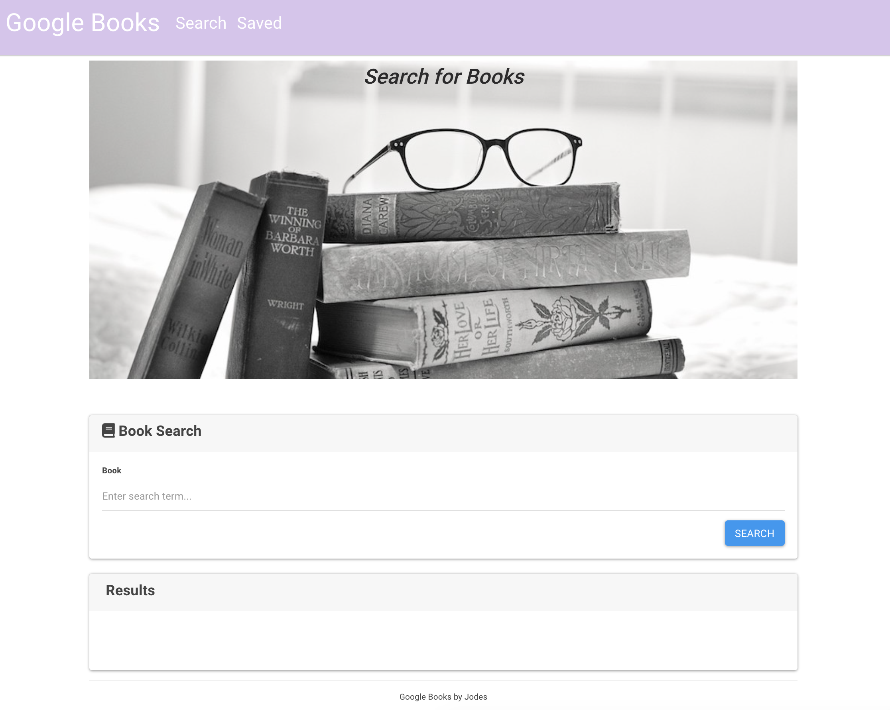
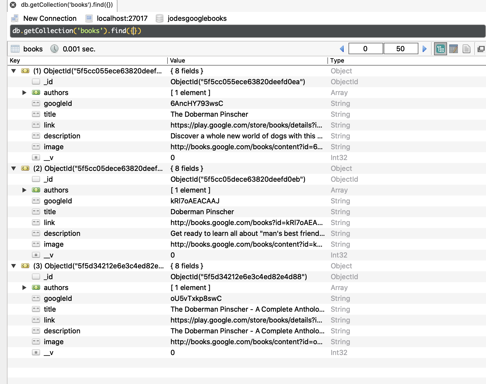
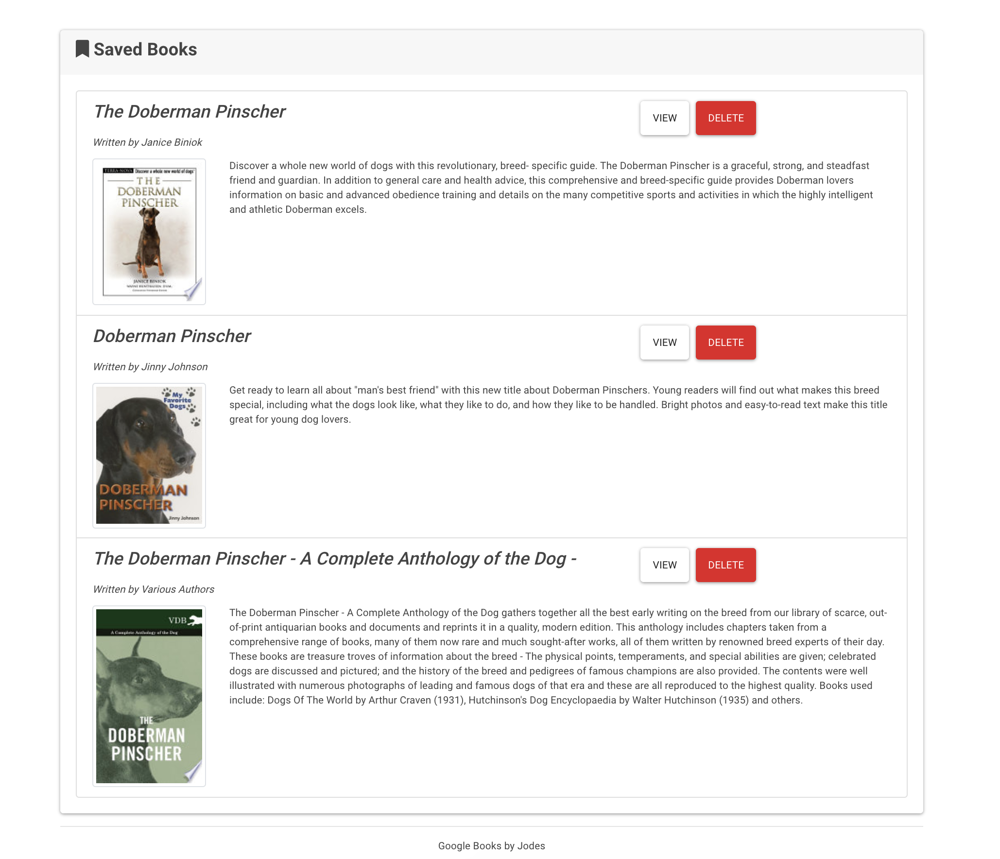

# Google_Books 

  ## Overview 
  MERN stack appplication.  React components, work with helper/util functions, and utilize React lifecycle methods to query and display books based on user searches. Also uses Node, Express and MongoDB so users can save books to review or purchase later.

  ## Table of Contents:
  - [Links to Deployed app](#Links (*deployed app and repo*))
  - [Screenshots and Vids](#Screenshots_and_Vids)
  - [Motivation](#Motivation)
  - [Installation](#Installation)
  - [How to use](#How_to_use)
  - [License](#License)
  - [Contribute](#Contribute)

 ## Links (*deployed app and repo*)
  - [Heroku](https://www.herokuapp.com/)
  - [GitHub Repo](https://github.com/jmeggles/Google_Books)

 ## Screenshots_and_Vids 
  - 
  -   
  - 
  -   
  
  ## Motivation
  Inspired by a class project. I wanted to build an app to showcase my knowledge of how MongoDB, Express, React, and NojeJs work together for a fullstack MERN application.

  ## Installation  
  No install needed. Just follow [this link](https://www.herokuapp.com/) to the deployed application!

  Or, clone application, then in the root folder add package with `npm i` then `npm start` to run application. Installation of MongoDB wil also need to be added.

  ## How_to_use
  - Click the "Search" link at the top of the page, then type a book into the search bar to search for your favorite books. 
  - From the results, Click "View", which opens a browser Google Books page, with the book informaton.
  - Click "Save" button by the book to save it in a list for later.
  - Click "Saved" link at the top of the page to view save books from your list.
  - From the "Saved" page, Click "View" to go to the Google book page of that book for more information. 
  - From the "Saved" page, Click "Delete" to remove a book from your collection.

  ## License 
  [MIT License](https://opensource.org/licenses/MIT)
  
  ## Contribute
  To contribute to this project, fork repo and commit changes.  
  For comments and/or questions, contact Jody Eggleston via 
  [Linkedin](https://www.linkedin.com/in/jody-eggleston/)

  Copyright © 2020 Jody Eggleston 
